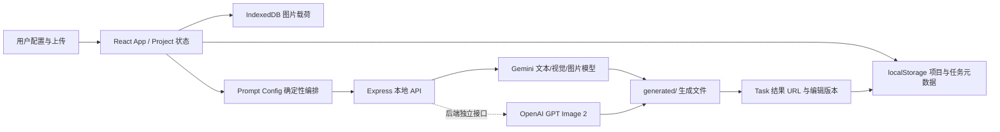

# 巴迪高品牌视觉工作台：Agent 项目说明书

> 面向接手本项目的开发 Agent。本文基于 2026-07-16 的当前工作树整理；当前分支为 `main`，HEAD 为 `34a95e7`（`feat: improve prompt previews and scene consistency`）。工作树仍有未提交改动，接手时先运行 `git status --short`，不要覆盖用户现有修改。

## 1. 一句话定位

这是一个本地运行的单页 Web 工作台，用于把巴迪高产品图、人物图、风格参考图和业务参数编排成品牌视觉提示词，再通过 Gemini 生成图片、保存生成批次，并对结果进行局部重绘。

当前主链路是 **Gemini 生图 + Gemini 局部重绘**。服务端另有 **OpenAI GPT Image 2 生图接口**，但尚未接入当前前端主按钮。

## 2. Agent 快速结论

- 应用形态：React 单页应用；Express 同时提供 API、开发期 Vite 中间件和生产静态文件。
- 当前导航：`创意工作台`、`生成历史`。
- 核心业务：项目配置 → 图片素材 → 规则化提示词 → Gemini 生图 → 批次记录 → 局部重绘。
- 持久化：浏览器 `localStorage` 保存项目/任务元数据，IndexedDB 保存上传图片，服务端 `generated/` 保存生成结果。
- Prompt 真源：`src/prompt-config/promptConfig.ts`，当前配置版本为 `badigao-v1.0.0`。
- 当前 A 类新增“绿色草地”场景；它有独立中英文场景描述，并显式排除海边、海水、沙滩和礁石。
- 主界面生图接口：`POST /api/gemini/generate-images`。
- 场景一致性：Prompt Preview 与 Gemini 生图接口均以当前结构化参数重新编译 Prompt，不再允许客户端缓存的旧 Prompt 覆盖当前场景。
- 任务一致性：生图请求会固定当前项目快照；服务端回传实际场景与 Prompt 快照，前端据此创建 Task。
- 旧结果隔离：任何项目参数变化都会清空 `activeTaskId`，避免旧批次结果与新场景 Prompt 并排显示；旧任务仍保留在历史中。
- OpenAI 接口状态：服务端已实现 `GET /api/openai/status` 与 `POST /api/openai/generate-images`，前端未使用。
- 局部编辑：真实调用 `POST /api/gemini/edit-image`，不是前端模拟。
- 视频能力：`VideoModal.tsx` 仍是模拟流程，而且未挂载到当前 App。
- 品牌资产页：`BrandAssetsPage.tsx` 存在，但未挂载到当前导航。
- 自动化检查：没有测试套件；当前以 TypeScript 检查和生产构建作为基础门禁。

## 3. 当前功能成熟度

| 能力 | 当前状态 | 说明 |
| --- | --- | --- |
| 多项目创建与切换 | 已可用 | 项目保存在浏览器本地；没有账号、远端数据库或协作机制。 |
| 产品图上传 | 已可用 | UI 要求至少一张产品图才能生成；可设置主图。 |
| 人物图上传 | 已可用 | 支持 0–4 人配置；0 人时 Prompt 会切换为严格无人画面规则。 |
| 风格参考图 | 已可用 | UI 最多 5 张，可设高/中/低权重；可影响视觉风格与画面组织，但禁止复制主体、人物身份、脸、身体和服装设计。 |
| A/B/C 视觉类型 | 已可用 | A=品牌情绪，B=真实使用，C=功能卖点。 |
| 中英文 Prompt 编排 | 已可用 | 本地确定性规则生成；图片分析可由 Gemini Vision 补充。 |
| 实际生图 Prompt 预览 | 已可用 | 前端防抖调用 Gemini Prompt Preview 接口；服务端按当前结构化参数权威重编译中英文 Prompt。 |
| Gemini 多参考图生图 | 已可用 | 当前 UI 的正式生图主链路。 |
| 场景与生成记录一致性 | 已修复 | 旧缓存 Prompt 不再覆盖当前场景；Task 使用服务端确认的场景和 Prompt 快照。 |
| GPT Image 2 生图 | 后端已实现 | 未接入 UI；需要显式改造提供方选择或切换调用地址。 |
| 生成历史与参数恢复 | 已可用 | 保存参数快照和结果 URL；最多持久化最近 30 条。 |
| 单图/批量下载 | 已可用 | 批量下载使用 JSZip。 |
| 局部涂抹重绘 | 已可用 | 支持蒙版、撤销/重做、可选替换参考图和版本记录。 |
| 品牌资产中心 | 未接入 | 组件存在，App 未导入和渲染。 |
| 图生视频 | 模拟且未接入 | 组件内部是计时/样式模拟，不是真实视频 API。 |
| 登录、云同步、多人协作 | 未实现 | 当前完全是本地单用户工具。 |

## 4. 技术栈与运行方式

### 4.1 技术栈

- Node.js 20+
- React 19 + TypeScript 5.8
- Vite 6
- Express 4
- Tailwind CSS 4（通过 Vite 插件）
- Google GenAI SDK
- `undici`：OpenAI 请求及代理支持
- `lucide-react`、`motion`
- `jszip`、`file-saver`

### 4.2 常用命令

```powershell
npm.cmd install
npm.cmd run dev
npm.cmd run lint
npm.cmd run build
npm.cmd start
```

Windows 下优先使用 `npm.cmd`，避免 PowerShell 执行策略拦截 `npm.ps1`。

- 开发地址：`http://127.0.0.1:3000/`
- `npm run dev`：由 `tsx` 直接运行 `server.ts`，Express 挂载 Vite middleware。
- `npm run build`：先构建前端，再把 `server.ts` 打包为 `dist/server.cjs`。
- `npm start`：运行生产服务端产物。
- `npm run lint`：实际执行 `tsc --noEmit`，不是 ESLint。

### 4.3 环境变量

复制 `.env.example` 为 `.env.local`。服务端优先读取 `.env.local`，再读取 `.env`。

| 变量 | 用途 | 默认值/备注 |
| --- | --- | --- |
| `GEMINI_API_KEY` | Gemini 文本、视觉、生图、编辑 | 当前主链路必需 |
| `GEMINI_API_BASE_URL` | Gemini API 基地址 | 默认 Google `v1beta` 地址 |
| `GEMINI_IMAGE_MODEL` | Gemini 生图/编辑模型 | `gemini-3-pro-image` |
| `GEMINI_TEXT_MODEL` | Prompt 润色/安全重试 | `gemini-3.5-flash` |
| `GEMINI_VISION_MODEL` | 参考图分析 | 回退到文本模型 |
| `OPENAI_API_KEY` | GPT Image 2 | 仅后端独立接口使用 |
| `OPENAI_IMAGE_MODEL` | OpenAI 图片模型 | `gpt-image-2` |
| `OPENAI_IMAGE_QUALITY` | OpenAI 输出质量 | 未配置时按分辨率映射 |
| `HTTP_PROXY` / `HTTPS_PROXY` | OpenAI 出站代理 | 由 `undici.ProxyAgent` 使用 |
| `PORT` | 本地服务端口 | `3000` |

不要读取、打印、复制或提交 `.env.local` 中的实际密钥。所有密钥只在服务端使用，不要改成 `VITE_*` 变量。

## 5. 总体架构



### 5.1 前端职责

- 管理当前项目、任务、选中批次和 UI 状态。
- 上传并压缩参考图，分配产品/人物/风格角色。
- 调用本地 Prompt、Gemini 生图和编辑接口。
- 展示生成结果、参考素材与参数快照。
- 保存本地项目/任务元数据，恢复历史参数。

### 5.2 服务端职责

- 保管 API Key，前端永远不直接访问模型提供方。
- 编排 Prompt 与参考图角色约束。
- 调用 Gemini/OpenAI。
- 将模型返回的图片写入 `generated/`，并通过 `/generated/*` 静态提供。
- 开发环境托管 Vite，生产环境托管 `dist/`。

## 6. 目录与关键文件

```text
.
├─ server.ts                         # Express、全部模型 API、生成文件落盘、Vite/生产托管
├─ src/
│  ├─ App.tsx                        # 应用总状态、项目/任务生命周期、主生成流程、页面组合
│  ├─ types.ts                       # Project、Task、ImageAsset 等核心数据结构
│  ├─ prompt-config/
│  │  └─ promptConfig.ts             # A/B/C、场景、卖点、镜头、色调、Prompt 编译真源
│  ├─ data/
│  │  ├─ imagePreparation.ts         # 上传校验、缩放和压缩
│  │  ├─ imageAssetStore.ts          # IndexedDB 图片持久化与 localStorage 瘦身
│  │  └─ mockAssets.ts               # 旧演示素材与模拟生成逻辑；当前主链路未使用
│  └─ components/
│     ├─ SidebarParams.tsx           # 左侧素材上传与全部生成参数
│     ├─ CanvasArea.tsx              # Prompt、结果对比、下载、预览与编辑入口
│     ├─ TaskPanel.tsx               # 当前参数摘要与项目内最近任务
│     ├─ HistoryPage.tsx             # 全局历史、筛选、收藏、恢复、删除
│     ├─ EditorModal.tsx             # 真实 Gemini 局部重绘
│     ├─ CustomSelect.tsx            # 通用选择器
│     ├─ BrandAssetsPage.tsx         # 未挂载品牌资产页
│     └─ VideoModal.tsx               # 未挂载的模拟视频流程
├─ generated/                        # 本机生成结果；被 Git 忽略
├─ dist/                             # 生产构建产物；被 Git 忽略
├─ .env.example                      # 环境变量模板
├─ README.md                         # 面向使用者的简要说明，信息少于本文
└─ AGENT_PROJECT_GUIDE.md            # 本文
```

## 7. 核心业务与数据流

### 7.1 项目与素材

`Project` 是当前工作配置，包含：

- 产品图、人物图、风格图
- 人数和是否保持人物
- A/B/C 视觉类型、场景、产品卖点
- 景别、机位、色调、比例、分辨率、生成张数
- 用户补充描述
- 编译后的中英文正负 Prompt、规则版本、选中片段和警告

上传图片经过 `prepareImageForReference()`：

1. 只接受图片。
2. 单文件上限 20 MB。
3. 最长边压缩到不超过 1600 px。
4. PNG 保持 PNG，其余输出为 JPEG（质量 0.86）。
5. Data URL 写入 IndexedDB，项目元数据只保留 `storageKey`，避免挤爆 localStorage。

### 7.2 Prompt 编排

`compilePrompt()` 是确定性规则核心，按以下层级组装：

1. 品牌与任务
2. A/B/C 视觉类型
3. 场景视觉基因
4. 人物或无人画面规范
5. 产品高保真和参考图职责
6. 图片视觉分析
7. 产品卖点
8. 摄影参数
9. 色彩与输出
10. 批次差异化
11. 用户补充创意
12. 质量底线与负面约束

最重要的业务原则：**产品还原优先于创意发挥**。风格参考图可影响视觉风格、光影、色彩、影调、景深、留白、姿势、动作、裁切、机位、背景、家具、道具、建筑、物体位置与构图，但禁止复制参考图的主体、人物身份、脸、身体和服装设计。低/中/高权重只改变影响强度，不改变这五项禁止边界。

Prompt 选项现状：

- A 类场景：海边自在、绿色草地、居家松弛、米色自在、蓝色洁净
- B 类场景：居家柔弹与立体包裹、蓝色洁净功能证据系统
- C 类：没有场景列表，直接选择功能卖点
- 卖点：14 项，包括吸水、透气、弹力拉伸、不起球、不掉絮、灭菌、A类母婴级、便携、亲肤、透气不闷汗、爽滑、不夹臀、3D版型、大码包容
- 景别：全景、中景、远景、近景、特写、大特写
- 角度：平视、俯视、侧视
- 色调：米色调、蓝色调
- 比例：1:1、2:3、3:2、3:4、4:3、9:16、16:9
- 分辨率：1K、2K、4K
- 单次生成：1、2、4、6 张

### 7.3 生成批次

前端点击“生成品牌视觉”后：

1. 调用 `POST /api/gemini/generate-images`。
2. 前端先固定 `generationProject` 快照，并发送当前场景、风格图权重、图片分析和参考图数据。
3. 服务端忽略客户端可能残留的旧正负 Prompt，以当前结构化参数调用 `compilePrompt()`，生成本次权威中英文 Prompt。
4. 参考图按产品主图、产品细节、人物身份、风格参考排序并附加角色约束。
5. 逐张调用 Gemini；若命中 `IMAGE_SAFETY`，会用文本模型安全润色后重试一次。
6. 返回图片写入 `generated/`。
7. 服务端同时回传实际 `scene`、中英文正负 Prompt、配置版本、选中片段和警告。
8. 前端使用生成前快照与服务端回传信息创建 `Task`，保存实际参数、结果 URL、编辑版本和视频字段。

`Task` 是不可变批次快照的意图载体，但编辑版本会继续追加到该任务中。

项目参数发生变化时，`handleUpdateProject()` 会将 `activeTaskId` 设为 `null`。这是有意行为：旧批次仍在历史中，但不再与新参数对应的 Prompt 同屏展示。

### 7.4 局部重绘

编辑器允许用户：

- 在图片上绘制/擦除蒙版
- 撤销、重做、清空选区
- 上传一张可选局部替换参考图
- 输入不超过 1000 字的修改要求
- 保存多次编辑版本并在版本间切换

服务端读取原图、蒙版和替换图，调用 Gemini 图片模型，最长等待约 4 分钟，结果同样写入 `generated/`。

## 8. 本地持久化

### 8.1 localStorage 键

| 键 | 内容 |
| --- | --- |
| `badigao_projects` | 去除 Data URL 后的项目列表 |
| `badigao_tasks` | 去除 Data URL 后的任务列表，最多 30 条；空间不足时回退到 10 条 |
| `badigao_current_proj_id` | 当前项目 ID |
| `badigao_default_image_count_v1` | 默认生成张数迁移标记 |
| `badigao_favorites` | 历史收藏任务 ID |

### 8.2 IndexedDB

- 数据库：`badigao-image-assets`
- Object Store：`images`
- 用途：保存用户上传图片的 Data URL

### 8.3 文件系统

- 所有真实生成图和编辑图保存在 `generated/`。
- `generated/` 被 Git 忽略，不是可靠的长期资产库。
- 浏览器历史只保存结果 URL；如果 `generated/` 被清理，历史记录仍可能存在，但图片会失效。
- 当前没有服务端数据库、对象存储、备份、清理策略或跨设备同步。

## 9. 本地 API 清单

| 方法与路径 | 用途 | 当前调用方 |
| --- | --- | --- |
| `POST /api/prompt/generate` | 确定性编排 Prompt；缺失分析时可分析图片 | 当前前端 |
| `POST /api/gemini/prompt-preview` | 按当前结构化参数重新编译并构造实际提交给 Gemini 的最终 Prompt 预览 | 当前前端 |
| `POST /api/gemini/generate-images` | Gemini 多参考图批量生图；回传实际场景和 Prompt 快照 | 当前前端主链路 |
| `POST /api/gemini/edit-image` | 蒙版局部重绘 | 当前前端编辑器 |
| `GET /api/gemini/status` | 查看 Gemini 是否配置及模型名 | 手动诊断 |
| `POST /api/gemini/analyze-assets` | 单独分析参考图 | 后端能力；主 UI 无直接按钮 |
| `POST /api/gemini/optimize` | Gemini 润色 Prompt，失败时回退确定性 Prompt | 后端能力；当前主 UI 未调用 |
| `GET /api/openai/status` | 查看 OpenAI 是否配置及模型名 | 手动诊断 |
| `POST /api/openai/generate-images` | GPT Image 2 批量生图 | 后端已实现；当前 UI 未调用 |

新增或修改 API 时，优先保持统一响应风格：成功返回 `results`/结果字段与 `model`；失败返回 JSON `error`，必要时附 `code`、`details`、`requestId`。

## 10. 容量与边界

- Express JSON body 上限：50 MB。
- 浏览器单张上传源文件上限：20 MB。
- 服务端单张参考图上限：20 MB。
- UI 风格图上限：5 张。
- 服务端全部参考图上限：8 张。
- Gemini 单次生成张数上限：6 张。
- 历史持久化上限：30 条；localStorage 失败时回退 10 条。
- 局部编辑文本上限：1000 字。
- 编辑请求超时：约 4 分钟。

注意：产品图 + 人物图 + 风格图总数可能在前端超过服务端 8 张限制。改上传数量或人数时，必须同步检查前后端限制。

## 11. 已知缺口与易误判点

1. **README 落后于代码**：README 只介绍 Gemini，没有说明 OpenAI 后端接口、IndexedDB、局部编辑和未接入组件。
2. **OpenAI 未接 UI**：不要因为服务端有接口就声称用户可以在界面选择 GPT Image 2。
3. **品牌资产页未接入**：组件存在不等于产品功能可见。
4. **视频是模拟能力**：`VideoModal` 没有真实视频 API，也未挂载。
5. **旧模拟数据仍存在**：`mockAssets.ts`、`DEMO_TASK` 及部分导入属于遗留演示代码；当前真实生图不使用 `getSimulatedImages()`。
6. **“保存参数”按钮只显示通知**：项目参数在每次更新时已经自动写入本地；按钮本身不额外创建版本或远端保存。
7. **无自动测试**：项目没有 `test` 脚本和测试文件，不能把构建通过等同于业务回归通过。
8. **生成文件是本机临时资产**：清理 `generated/` 会破坏历史图片链接。
9. **任务素材快照不完整**：为节省空间，Data URL 在任务序列化时会被移除；恢复任务主要恢复参数，不保证恢复当时所有上传图载荷。
10. **`keepCharacter` 语义未完全落地**：数据结构保留该字段，但当前生成请求主要通过 `modelCount` 与人物参考图决定人物规则。
11. **包名仍为占位名**：`package.json` 中的 `name` 是 `react-example`，不代表产品名。
12. **没有权限与内容治理后台**：模型安全错误主要依靠 Prompt、安全重试和错误提示处理。
13. **Prompt 配置版本未随规则变化递增**：当前仍是 `badigao-v1.0.0`，但绿色草地、风格参考边界和场景一致性规则已经变化。后续若依赖版本做迁移或审计，应先升级版本号。
14. **参考图分析器仍有旧版风格描述**：`server.ts` 的 Gemini Vision 分析系统提示仍写着“style_reference 只能影响构图、光影、色彩、影调和氛围”，比当前生成链路允许的风格影响范围更窄。主生图边界已更新，但重新做资产分析时可能得到偏保守的 `allowedInfluence`。
15. **现有历史结果不会被新规则重算**：切换为“绿色草地”后，旧“海边自在”任务仍可在历史中看到；只有重新生成的批次才使用新场景规则。

## 12. 修改任务时从哪里开始

| 需求类型 | 优先查看 |
| --- | --- |
| 改 A/B/C、场景、卖点、镜头、色调或 Prompt | `src/prompt-config/promptConfig.ts` |
| 改主流程、项目/任务状态、生成提供方 | `src/App.tsx` |
| 改上传数量、图片角色或左侧参数 | `src/components/SidebarParams.tsx` |
| 改结果展示、对比、下载、预览 | `src/components/CanvasArea.tsx` |
| 改历史筛选、恢复、收藏 | `src/components/HistoryPage.tsx` |
| 改局部重绘 UI | `src/components/EditorModal.tsx` |
| 改模型请求、API、错误映射、落盘 | `server.ts` |
| 改本地图片存储 | `src/data/imageAssetStore.ts`、`src/data/imagePreparation.ts` |
| 改核心字段 | 先改 `src/types.ts`，再检查 App、存储迁移和所有组件 |

## 13. Agent 工作原则

1. 以当前代码和真实浏览器行为为准，README、旧注释和模拟组件只能作为辅助信息。
2. 改 Prompt 前先区分：品牌规则、产品规则、场景规则、技术/安全脚手架。
3. 产品高保真与安全边界是硬约束，不应被风格参考或创意描述覆盖。
4. 不要把 API Key 放入前端、日志、截图、提交或文档。
5. 不要提交 `generated/`、`dist/`、日志、`.env.local`、`node_modules/`。
6. 修改持久化结构时必须考虑旧 localStorage 数据的兼容/迁移。
7. 修改图片字段时同时检查 IndexedDB hydration 和序列化瘦身逻辑。
8. 接入新模型提供方时，不只切 URL：还要核对参考图输入方式、尺寸映射、质量参数、错误码、结果格式和 UI 文案。
9. 删除“看似未使用”的代码前，先确认它是否是下一阶段预留；如果决定删除，应同时清理导入、类型和文案。

## 14. 交付前验证清单

最低检查：

```powershell
npm.cmd run lint
npm.cmd run build
```

涉及业务流程时还应启动应用并手工检查：

1. 新建/切换项目。
2. 上传产品图、人物图、风格图；刷新后图片仍可恢复。
3. A/B/C 切换时场景、色调和卖点显示正确。
4. 生成 Prompt 后中英文正负 Prompt 与警告正确。
5. 切换场景后旧结果区域应退出，历史任务仍应保留。
6. 对“绿色草地”调用 Prompt Preview，确认正向 Prompt 包含 `grassland`/`lawn`，负向 Prompt 包含 `seaside, sea, ocean`，并且旧海边 Prompt 文本不能覆盖当前场景。
7. `GET /api/gemini/status` 返回预期配置状态。
8. 使用低成本参数生成 1 张图，确认实际场景、`generated/` 落盘和历史新增。
9. 打开结果、下载、设为参考图、恢复历史参数。
10. 局部涂抹编辑并确认新版本写入任务。
11. 刷新页面，确认项目、任务和上传图片恢复正常。

涉及 OpenAI 时额外检查 `GET /api/openai/status`，并明确测试的是独立后端接口还是已经完成前端接入。真实调用可能受账户额度、代理和模型权限影响。

## 15. 本次文档快照的验证结果

- `npm.cmd run lint`：通过。
- `npm.cmd run build`：通过。
- Vite 成功构建 1690 个模块。
- 本地服务已在 `http://127.0.0.1:3000/` 启动，首页返回 HTTP 200。
- 已在线验证 `POST /api/gemini/prompt-preview`：当场景为“绿色草地”时，英文 Prompt 包含 `grassland`/`lawn`，负向约束包含 `seaside, sea, ocean`。
- 已验证即使请求中故意附带旧海边 Prompt，服务端仍会丢弃旧 Prompt 并按当前结构化场景重新编译。
- 本轮没有额外触发一次真实 Gemini 生图，因此“绿色草地”的最终模型出图效果仍应按第 14 节做一次低成本人工回归。
- 仓库没有测试脚本，未执行自动化业务测试。

后续若功能发生变化，应优先同步本文第 2、3、6、9、11、12、15 节。
